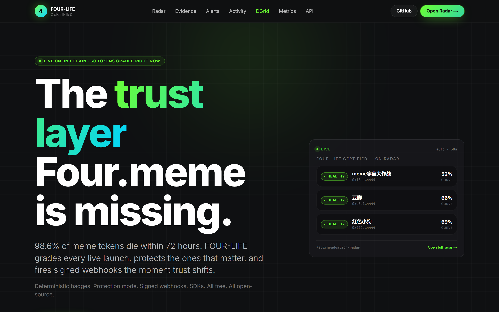
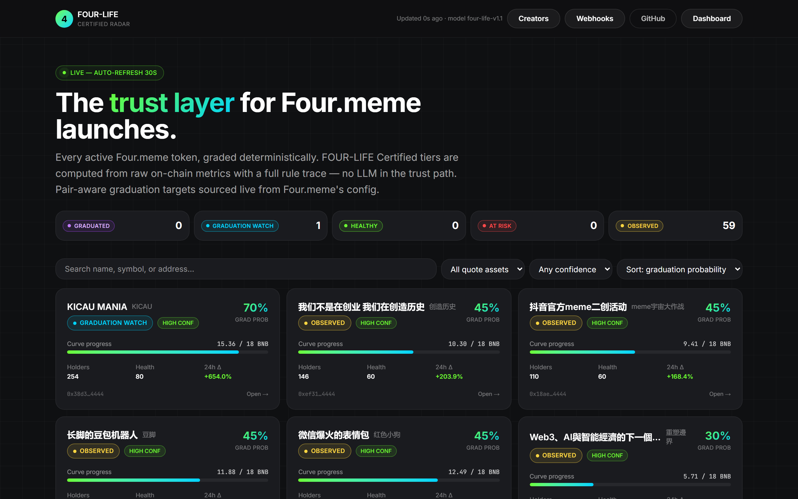
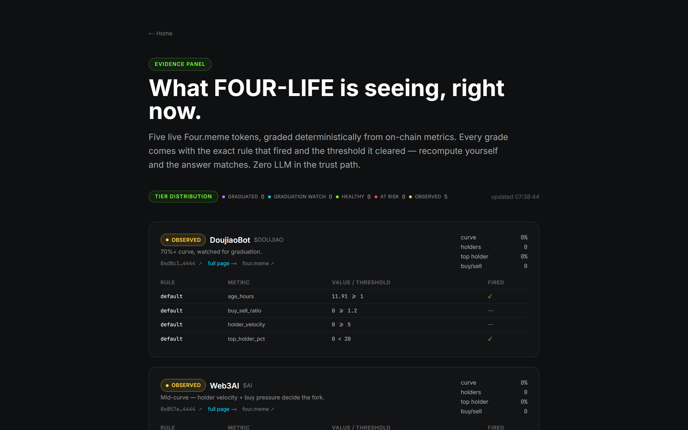
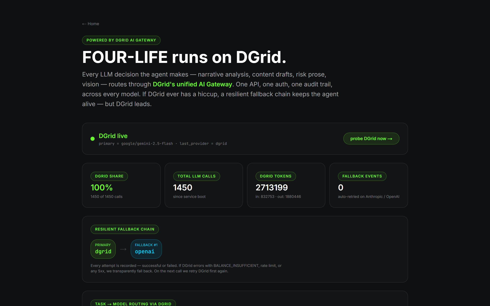
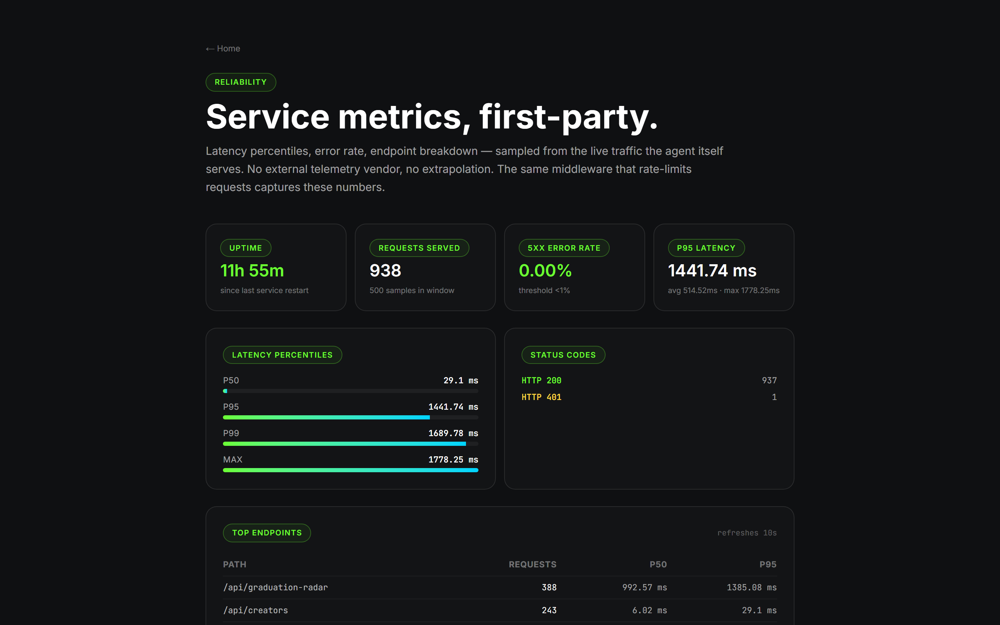
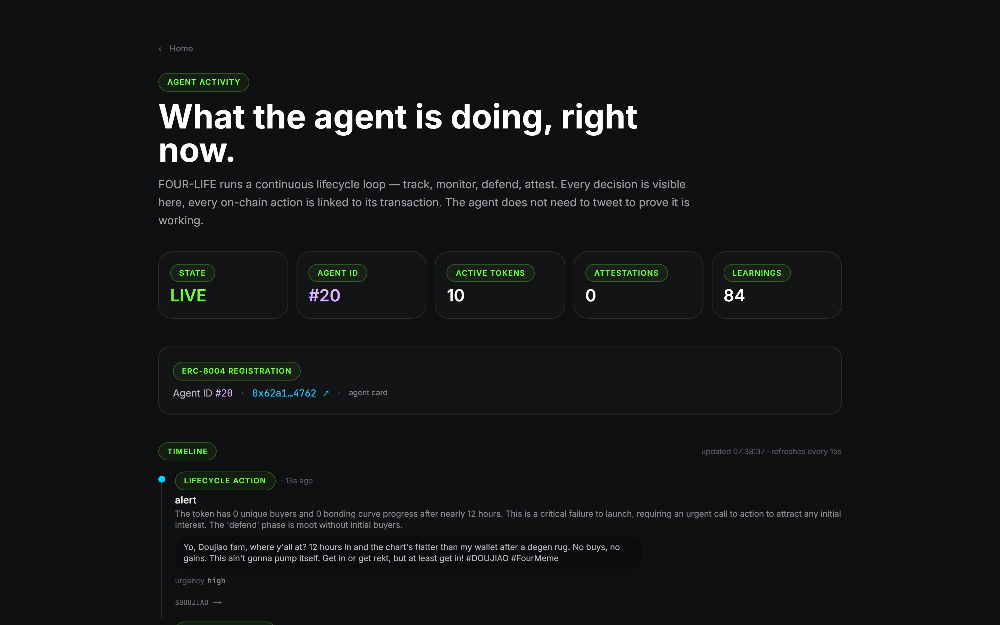
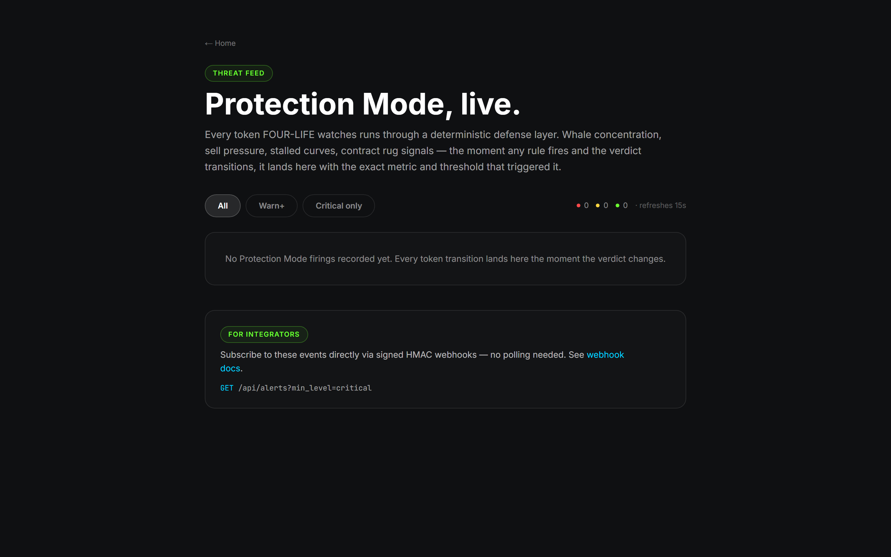
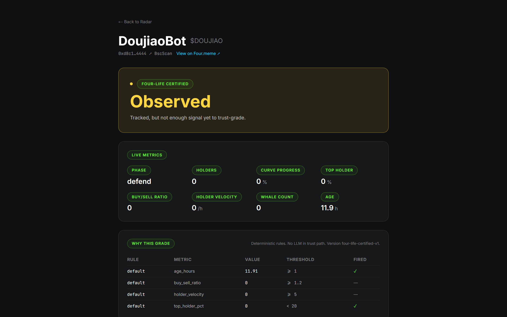

<div align="center">

# FOUR-LIFE

**Phase 4 for every Four.meme launch.**

The autonomous lifecycle agent that grades every Four.meme token with pure on-chain rules (zero LLM in the trust path) and Merkle-commits every operational LLM decision to BNB Chain.

[](./LICENSE)
[](#tests)
[](https://four-life.gudman.xyz)
[](./extension)
[](https://bscscan.com/tx/0x62a1a43d9e782686b833ed44eee7ea95a9ee3370f2f372334dc7bbf85cc14762)
[](https://pypi.org/project/four-life/)
[](https://www.npmjs.com/package/@gudman/four-life-sdk)

[Live site](https://four-life.gudman.xyz) · [Proof ledger](https://four-life.gudman.xyz/proof) · [Live radar](https://four-life.gudman.xyz/radar) · [API docs](https://four-life.gudman.xyz/docs) · [Agent card](https://four-life.gudman.xyz/.well-known/agent-registration.json)

<br />



</div>

---

## The problem

Four.meme launches ~50 tokens a day. **Only 1.34% ever graduate.** The other 98.6% die silently inside 72 hours — from whale rugs, stalled curves, coordinated sell pressure, or neglect.

Every existing tool (GoPlus, Pocket Universe, Rabby, DexTools, ScamSniffer) tells a trader **what already happened**. FOUR-LIFE runs the agent loop **as tokens are living and dying** — so the trust grade and lifecycle decisions exist while there's still time to react.

## What FOUR-LIFE is

An autonomous agent (ERC-8004 Agent #20 on BNB Chain) that produces four verifiable primitives from one live data stream:

| # | Primitive | What it is | Surface |
|---|---|---|---|
| 1 | **Certified badge** | Deterministic 5-tier grade with full `why[]` rule trace. Zero LLM in the trust path — anyone can reproduce it. | `/api/token/{addr}/badge`, extension pill, `/radar` |
| 2 | **Creator survival score** | Aggregate track record per deployer wallet — launches / graduations / trust tier. | `/api/creator/{wallet}/survival-score`, extension panel |
| 3 | **MYX hedge signal** | DGrid-consensus DEFEND decision per tracked token. Execution is broker-gated upstream; every decision is hash-chained locally and published roots are anchored on-chain. | `/api/myx/signal/{addr}`, `/myx` |
| 4 | **On-chain attestation log** | Every operational LLM call routes through DGrid; digest + chain tip is hashed, folded into a rolling SHA-256 root, published as a BNB Chain transaction. | `/api/dgrid/audit`, `/proof` |

> **No off-chain oracles for trust. No LLM-graded trust scores. Every claim has a BscScan transaction behind it.**

---

## Why it wins vs every other meme-token tool

| | **FOUR-LIFE** | GoPlus | Pocket Universe | Rabby | DexTools | ScamSniffer |
|---|:---:|:---:|:---:|:---:|:---:|:---:|
| Deterministic rule trace (no LLM in trust path) | ✅ | ❌ | ❌ | ❌ | ❌ | ❌ |
| On-chain Merkle attestation of LLM decisions | ✅ | ❌ | ❌ | ❌ | ❌ | ❌ |
| ERC-8004 agent identity + reputation | ✅ | ❌ | ❌ | ❌ | ❌ | ❌ |
| Pre-swap firewall modal on at-risk | ✅ | ⚠️ | ✅ | ⚠️ | ❌ | ⚠️ |
| 4-site extension coverage (four.meme, BscScan, PancakeSwap, DEXScreener) | ✅ | ❌ | ❌ | ❌ | ❌ | ❌ |
| Right-click "grade any address anywhere" | ✅ | ❌ | ❌ | ❌ | ❌ | ❌ |
| Creator reputation aggregated per deployer | ✅ | ❌ | ❌ | ❌ | ⚠️ | ❌ |
| Snapshot history sparkline per token | ✅ | ❌ | ❌ | ❌ | ✅ | ❌ |
| Embeddable Certified badge widget | ✅ | ❌ | ❌ | ❌ | ❌ | ❌ |
| Multi-provider LLM gateway (DGrid → Anthropic → OpenAI) | ✅ | — | — | — | — | — |
| Public SDK in Python + TypeScript | ✅ | ⚠️ | ❌ | ✅ | ❌ | ❌ |
| Open source (MIT) | ✅ | ⚠️ | ❌ | ✅ | ❌ | ❌ |

✅ shipped · ⚠️ partial · ❌ absent · — not applicable

---

## Live proof (verifiable right now)

```
Agent wallet     0x695E492398A51D2Ef5c699818e9616718aaEd1c1
ERC-8004 ID      #20
Launches          32          Graduations     5 (15.6% vs platform 1.34%)
DGrid chained    1,573        MYX chained     518
Attestation txs  6            Certified live  8
```

**BNB-Chain Merkle-root transactions you can open on BscScan right now:**

- DGrid: [`0xab323590…`](https://bscscan.com/tx/0xab323590f4aaa1013960ac77a89a215690ce731f72405c6b10f7bcd75973a636) (latest, 1,573 calls committed) · [`0x047c2f58…`](https://bscscan.com/tx/0x047c2f58e77d349f98eac8305080970c391c0e39c378816c22e69fc0d6b18fe9) · [`0xcf42283a…`](https://bscscan.com/tx/0xcf42283acebfc97657e87393684eedee40a21e98ba9c0b6b7480fa6c711a5c7c)
- MYX: [`0x5c5b9876…`](https://bscscan.com/tx/0x5c5b9876cc85d54e01b69d03ee8709d32370fe64374a02ddf1ac521ddc0437af) (latest, 518 decisions committed) · [`0xeda29cc6…`](https://bscscan.com/tx/0xeda29cc60bc8ca9bb3b3d8f78cf0200cd39cd50a3b80cbb0f411d25025232026) · [`0x0d43051c…`](https://bscscan.com/tx/0x0d43051c24fd59359317d12ce3137512a1c7cb032528bf813d506545fcf06698)

**Graduated tokens deployed by the agent** (all at 100% curve, BscScan-verifiable on `/proof`):
[BIDUDU](https://bscscan.com/token/0x8846437a9231a3523558e36068b2ad1d3a2c4444) · [HOPE](https://bscscan.com/token/0xae7500a58857f04de0c63c633d408c618f3a4444) · [DRONE](https://bscscan.com/token/0x93a791d7da59a437c951cb6dcb2ea89eb71f4444) · [MLM](https://bscscan.com/token/0xbddd91e164a25dc9bde0feff0b9e7264a5064444)

**Agent's own live token**: [$AUNT](https://four.meme/en/token/0x568bf737887053ffa8aa4e82d8859ca4a9a14444) · [launch tx](https://bscscan.com/tx/0x80ff903ca947448ec50927b866067b67e5bdd69a667f9d0f1b3af8f0c74869d2) · deep-inspection panel on the extension.

---

## 60-second proof test

```bash
# 1. Live grade — same tier as the extension pill, the radar row, /proof
curl -s https://four-life.gudman.xyz/api/token/0x568bf737887053ffa8aa4e82d8859ca4a9a14444/badge \
  | jq '{tier: .badge.tier, tier_source, observation_status}'
# → {"tier":"at_risk","tier_source":"certified","observation_status":"partial_history"}

# 2. Chain-tip matches what's on BscScan
curl -s https://four-life.gudman.xyz/api/dgrid/audit \
  | jq '{root: .current_root, calls: .num_calls_chained, tx: .last_published_txhash}'
# → committed on BNB Chain at the tx hash above
```

---

## Quick start

Grade any Four.meme token in one line. Three languages, same endpoint, same answer.

**Python** — [`pip install four-life`](https://pypi.org/project/four-life/)

```python
from four_life import FourLife
fl = FourLife()
print(fl.get_badge("0x568bf737887053ffa8aa4e82d8859ca4a9a14444")["badge"]["tier"])
# → "at_risk"
```

**TypeScript** — [`npm install @gudman/four-life-sdk`](https://www.npmjs.com/package/@gudman/four-life-sdk)

```ts
import { FourLife } from "@gudman/four-life-sdk";
const fl = new FourLife();
const { badge } = await fl.getBadge("0x568bf737887053ffa8aa4e82d8859ca4a9a14444");
console.log(badge.tier, badge.tier_source); // "at_risk" "certified"
```

**curl**

```bash
curl -s https://four-life.gudman.xyz/api/token/0x568bf737887053ffa8aa4e82d8859ca4a9a14444/badge | jq '.badge'
```

**Embed a live Certified badge**

```html
<script src="https://four-life.gudman.xyz/embed.js?token=0x568bf737887053ffa8aa4e82d8859ca4a9a14444"></script>
```

**Chrome extension** (unpacked install, CWS listing pending)

```bash
git clone https://github.com/Ridwannurudeen/four-life
# chrome://extensions → Developer mode → Load unpacked → extension/
```

---

## The Chrome extension (v1.5.3)

A single MV3 extension that turns every BNB-Chain meme-token page into a certified trust surface.

### Injected on 4 sites

`four.meme/en/token/{addr}` · `bscscan.com/token/{addr}` · `pancakeswap.finance/swap?outputCurrency={addr}` · `pancakeswap.finance/info/tokens/{addr}` · `dexscreener.com/bsc/{pair}` (pair → base-token resolved via DEXScreener API).

### The pill (always visible, top-right)

- Tier-colored dot + live grade label
- **Red pulsing glow on `at_risk`** so a honeypot is structurally distinguishable from a Certified safe token at a glance (Rabby / Pocket Universe hazard convention)
- Purple glow on `graduated`, subtle green on `healthy`, neutral on `observed`/`graduation_watch`
- Honours `prefers-reduced-motion` — static color cues alone carry the tier signal

### The panel (click the pill)

- **Animated SVG health-score ring** (0–100, tier-colored arc)
- **Tier-glow hero** with certified/radar kicker, description, and 3 headline chips (Curve / Age / Health or Grad-confidence)
- **Freshness ticker** — `"Grade updated 23s ago"`, flips yellow past 60s
- **Agent attestation strip** — live DGrid + MYX Merkle-root transactions, linked to BscScan
- **Deployer reputation card** — launches tracked, graduations, grad-rate, trust tier — or explicit "Unknown dev" if untracked (absence is a signal)
- **Contract-safety checklist** — 6 checks: BscScan verified, mint, blacklist, pause, proxy, ownership renounced — with overall 0–100 risk score
- **Snapshot-history sparkline** — SVG curve-progress line + tier-transition dot strip + legend
- **Rule trace cards** — every deterministic rule with an ℹ tooltip translating the threshold to plain English
- **Severity-coded risk evidence** cards with inline SVG icons (triangle for critical/high, info circle otherwise)
- **Error / empty / retry states** — every lazy-fetched card surfaces `"Data unavailable · Retry"` with a working retry button on API failure (previously silent)
- **Sticky footer actions**: Share to X · FOUR-LIFE · /proof · Agent wallet · **Swap ↗ (firewall-gated on at_risk)**

### The firewall — the single feature that turns FOUR-LIFE from dashboard into safety product

Click **Swap ↗** on an at-risk token → instead of opening PancakeSwap, a red block modal appears quoting the top 2–3 critical evidence rows, with a primary **`Cancel — stay safe`** button and a muted **`Override anyway`** secondary. The destructive navigation only fires if you explicitly override.

### Beyond the pill

- **Right-click context menu**: highlight any `0x…` address on any webpage (Twitter, Telegram, Discord web, email), right-click → `Grade "0x…" with FOUR-LIFE` opens the full rule trace in a new tab. Works everywhere, not just the 4 injected sites
- **Full page ↗ action** in the panel header — opens `/radar?token=<addr>` in a real browser tab (bookmarkable, back/forward, shareable)
- **Expand/shrink drawer** (460px ↔ min(1100px, 95vw)) with a persistent left-edge resize bar
- **Keyboard shortcuts**: `F` expand · `W` watch · `C` copy address · `S` share to X · `P` open full page · `Esc` close
- **Popup dashboard** — status rail, 4 stat cards (Agent ID, Active tokens, DGrid chained, MYX chained), on-chain attestation pills, watchlist, top-5 radar with visual curve-progress underline, live agent-activity feed polling every 20s
- **Chrome notifications on tier transitions** — ★ Watch any token, `chrome.alarms` polls every 3min, tier/tier_source change fires a notification, click opens `/radar?token=<addr>`

---

## Architecture

```
                    ┌──────────────────────────────────────┐
                    │             FOUR-LIFE                 │
                    │   (autonomous lifecycle agent · #20)  │
                    │                                       │
                    │   THINK ─→ BIRTH ─→ RAISE ─→ LEARN    │
                    └────┬─────────────────────────────┬────┘
                         │                             │
           ┌─────────────▼───────────┐    ┌────────────▼────────────────┐
           │   Deterministic grade   │    │   Operational LLM decisions │
           │   (zero LLM in path)    │    │   (all through DGrid)       │
           │ • Certified badge       │    │ • Narrative picks           │
           │ • Risk snapshot         │    │ • Post content              │
           │ • Contract safety       │    │ • Raise plan generation     │
           │ • Creator survival      │    │ • MYX consensus DEFEND      │
           │ • Graduation radar      │    │ (every call hashed + folded)│
           └─────────────┬───────────┘    └────────────┬────────────────┘
                         │                             │
                         ▼                             ▼
           ┌──────────────────────────────────────────────────┐
           │           Rolling SHA-256 Merkle chain            │
           │                (two parallel chains)              │
           └─────────────┬────────────────────┬────────────────┘
                         │                    │
                         ▼                    ▼
           ┌──────────────────────────────────────────────────┐
           │              BNB Chain (chainId 56)               │
           │  • Four.meme TokenManager2                        │
           │  • BRC-8004 IdentityRegistry (Agent ID 20)        │
           │  • BRC-8004 ReputationRegistry                    │
           │  • MYX V2 Pool (pair-index resolution)            │
           │  • 3 DGrid root txs + 3 MYX root txs (6 total)    │
           └──────────────────────────────────────────────────┘

                         5 consumer surfaces read the same primitives:

   Extension       Website (14 routes)      SDKs (Py + TS)      Webhooks       Embeddable badge
   (4 sites)       /radar /proof /...       same tier           HMAC-signed    1-line <script>
```

---

## Live website — 14 routes

| Route | Purpose |
|---|---|
| [`/`](https://four-life.gudman.xyz) | Landing · hero · live stats · architecture diagram · try-it-now grade any token |
| [`/proof`](https://four-life.gudman.xyz/proof) | **Outcome ledger** · 32 launches / 5 grads / 15.6% · DGrid + MYX tx links · rule trace for $AUNT · graduated tokens |
| [`/radar`](https://four-life.gudman.xyz/radar) | Live grid · tier breakdown · quote/confidence/sort filters · deep-link drawer |
| [`/dashboard`](https://four-life.gudman.xyz/dashboard) | Token scanner (paste any address) · raise plan generator · MYX hedge signal |
| [`/launch/{addr}`](https://four-life.gudman.xyz/launch) | Shareable launch page per token |
| [`/creators`](https://four-life.gudman.xyz/creators) | Creator leaderboard with trust tier + grad rate |
| [`/evidence`](https://four-life.gudman.xyz/evidence) | 5 graded tokens with why-tables |
| [`/activity`](https://four-life.gudman.xyz/activity) | Agent timeline · every autonomous action · tx-linked |
| [`/alerts`](https://four-life.gudman.xyz/alerts) | Protection Mode threat feed |
| [`/dgrid`](https://four-life.gudman.xyz/dgrid) | DGrid health · breaker state · chaos toggle · consensus demo · cost · leaderboard |
| [`/myx`](https://four-life.gudman.xyz/myx) | MYX V2 integration · 37 markets · consensus DEFEND · signal + trade attestations |
| [`/metrics`](https://four-life.gudman.xyz/metrics) | p50 / p95 / p99 latency · error rate · endpoint breakdown |
| [`/webhooks`](https://four-life.gudman.xyz/webhooks) | HMAC-signed event subscriptions |
| [`/embed`](https://four-life.gudman.xyz/embed) | 1-line badge embed widget |
| [`/docs`](https://four-life.gudman.xyz/docs) | FastAPI Swagger UI · every endpoint, schema, try-it-out |

---

## Screenshots

| | |
|:---:|:---:|
|  |  |
| **`/radar`** · live grid, tier filters, deep-link drawer | **`/evidence`** · graded tokens with why-tables |
|  |  |
| **`/dgrid`** · gateway health · consensus demo · attestation tip | **`/metrics`** · p50 / p95 / p99 latency per endpoint |
|  |  |
| **`/activity`** · every autonomous action, tx-linked | **`/alerts`** · Protection Mode threat feed |
|  | |
| **`/launch/{addr}`** · shareable launch page per token | |

---

## API reference

Every public endpoint returns `tier_source`, `observation_status`, `quote_asset_source`, `confidence_score`, `fallback_used`, `data_sources`, `model_version`, and `last_updated_at` — consumers can audit the response without trusting the label.

### Platform primitives (public, no auth)

| Endpoint | Returns |
|---|---|
| `GET /api/token/{addr}/badge` | Certified tier + full `why[]` rule trace + creator wallet |
| `GET /api/token/{addr}/risk-snapshot` | Evidence-backed risk level, each flag traces to its metric |
| `GET /api/token/{addr}/operator-checklist` | Deterministic 72h action plan, phase-aware |
| `GET /api/token/{addr}/contract-risk` | Bytecode + ABI inspection — mint / blacklist / pause / proxy / ownership |
| `GET /api/token/{addr}/history` | Time-series of tier snapshots |
| `GET /api/graduation-radar?limit=&quote_asset=&min_confidence=&sort_by=` | Live filtered leaderboard (30s in-memory cache → ~12ms server-side hits) |
| `GET /api/creator/{wallet}/survival-score` | Deployer track record + deterministic trust tier |
| `GET /api/creators/leaderboard?sort_by=&min_launches=&limit=` | Full creator ledger |
| `GET /api/platform/cohorts` | Cohort analytics by age / narrative / quote asset / whale risk |
| `GET /api/tokens/{addr}` | Deep detail — health, phase, tier, concept, actions, launch record |

### DGrid integration surface

| Endpoint | Purpose |
|---|---|
| `GET /api/dgrid/stats` | Per-task routing, per-provider counters, fallback events, cost USD, breaker state |
| `GET /api/dgrid/health` | Green/amber/red reachability |
| `GET /api/dgrid/trace?limit=N` | Ring-buffer log of last 200 calls with per-entry chain tip |
| `GET /api/dgrid/leaderboard` | Per-(task, model) rolling stats — success rate, latency, cost |
| `GET /api/dgrid/audit` | Current Merkle root + last on-chain publish |
| `GET /api/dgrid/audit/calls?offset=&limit=` | Paginated full log for independent re-derivation |
| `POST /api/dgrid/probe` | Force a single DGrid-only call to verify the gateway |
| `POST /api/dgrid/compare` | Run the same prompt on N models side-by-side |
| `POST /api/dgrid/consensus` | Fan one prompt across N DGrid models + vote on JSON field |
| `POST /api/dgrid/chaos` | Toggle simulated DGrid outage to exercise the fallback chain live |
| `POST /api/dgrid/attest` | Publish the Merkle root on BNB Chain as a self-transaction (admin) |

### MYX V2 integration surface

| Endpoint | Purpose |
|---|---|
| `GET /api/myx/status` | Live connection state + 37 perp markets from `api.myx.finance` |
| `GET /api/myx/portfolio` | Per-token hedge summary, signals generated, active positions |
| `GET /api/myx/signal/{addr}` | DGrid-consensus DEFEND decision for a specific token |
| `GET /api/myx/signals?limit=N` | Append-only signal history (not ring-buffered) |
| `GET /api/myx/audit` | Trade-attestation Merkle tip + last publish |
| `GET /api/myx/signal-attestation` | Signal-attestation Merkle tip (separate chain from trades) |
| `POST /api/myx/consensus/{addr}` | Fire hedge decision across 3 DGrid models |
| `POST /api/myx/attest` / `/api/myx/attest-signals` | Publish roots on BNB Chain (admin) |

### Agent control

| Endpoint | Purpose |
|---|---|
| `POST /api/agent/start` · `POST /api/agent/stop` | Main loop control (auth) |
| `POST /api/agent/think` | One-shot THINK cycle (auth) |
| `POST /api/agent/track` | Begin lifecycle tracking for a token (auth) |
| `POST /api/raise-plan/{addr}` | Generate a 5-phase 72h raise plan (LLM + deterministic fallback) |
| `GET /api/status` | Running flag · agent_id · active_tokens · total_launches · grad rate |
| `GET /api/actions?limit=N` | Recent lifecycle actions |
| `GET /api/identity` | Agent card + every reputation attestation |
| `GET /.well-known/agent-registration.json` | ERC-8004 agent card |

### Webhooks

```
POST   /api/webhooks                    # Subscribe — secret returned once
GET    /api/webhooks                    # List (auth)
DELETE /api/webhooks/{id}               # Remove (auth)
GET    /api/webhooks/{id}/deliveries    # Attempt history (auth)
```

Events: `badge.tier_changed`, `protection.level_changed`.
Signature header: `X-FourLife-Signature: t=<unix>,v1=<hex_hmac_sha256(t + "." + body)>`.
Retry: 30s → 2m → 15m → dead. Auto-disable after 10 consecutive dead deliveries.

Full OpenAPI at [`/docs`](https://four-life.gudman.xyz/docs).

---

## DGrid AI Gateway — the agent's brain

Every operational LLM decision routes through [DGrid](https://dgrid.ai). Built to be defensible under any audit.

- **Circuit breaker** — opens after 3 consecutive DGrid failures with a 30s cooldown. Half-opens on the next call, closes on first success.
- **Transient retry** — one in-place retry on DGrid 5xx/network errors before falling back.
- **Multi-provider fallback** — DGrid primary → Anthropic → OpenAI. Every attempt (success or failure) lands in the trace ring buffer with provider identity, so auditors can see exactly which provider served which call.
- **Multi-model consensus** — `POST /api/dgrid/consensus` fans one prompt across N DGrid models and takes a majority vote. Wired into every DEFEND-phase decision.
- **Chaos toggle** — `POST /api/dgrid/chaos {enabled: true}` forces DGrid to fail so judges can watch the fallback chain engage live on stage. Deterministic recovery when disabled.
- **Cost tracking** — per-model USD rate table; every trace entry carries `cost_usd`; stats roll up by task / model / provider.
- **Hardened JSON parser** — 4-stage cascade (parse → balanced-bracket extract → unescaped-control-char repair → mid-string truncation close) so the agent survives LLM output corruption that kills naive integrations.
- **On-chain Merkle attestation** — every successful DGrid call is hashed into a rolling SHA-256 chain. Published tips are anchored on BNB Chain as self-transactions with the root in the tx `data` field. **3 DGrid roots on-chain, latest published root covers 1,573 calls.** Anyone can download the full log via `/api/dgrid/audit/calls` and verify locally — **zero server trust**.
- **Per-response provenance** — every public LLM-backed response carries an `llm_provider` field identifying which provider served that specific decision.

---

## MYX V2 — perp hedging with attested decisions

Phase-aware hedge signals with every decision cryptographically attested — independent of whether the trade executes.

- **Live connection** — 37 perp markets fetched live from `api.myx.finance`. `getPairIndex(WBNB, USDT)` resolves on-chain against the verified MYX V2 Pool `0x22cEc08111BBae24D0b80BDA2a6503EaB9BA704b`.
- **Phase-aware hedging** — NURTURE=monitor, DEFEND=short hedge (consensus-backed), ACCELERATE=scale, GRADUATED=close all.
- **DGrid consensus on DEFEND** — the highest-stakes decision (opening a short when a token shows weakness) fans across 3 DGrid models and takes a majority vote. Consensus metadata (method, tally, per-model verdict) preserved in every signal.
- **Two independent Merkle chains** — **trade attestation** chains every open/close position event; **signal attestation** chains every agent decision. Both publishable on-chain. **3 MYX roots on-chain, 518 decisions committed.**
- **Every production BSC mainnet address wired** — TRADING_ROUTER, ORDER_MANAGER, POSITION_MANAGER, BASE_POOL, QUOTE_POOL, ORACLE, FORWARDER, sourced from the official MYX SDK.
- **Execution: signal-only (broker-gated upstream).** MYX V2 routes orders through a permissioned **BrokerSigner** contract issued per integrator by the MYX team. Fork-simulation confirmed the broker gate reverts with `"disabled"` for any caller without a signed allowance. We shipped the complete infrastructure wired to the correct addresses; flipping `MYX_EXECUTION_ENABLED=true` + setting `MYX_BROKER_ADDRESS` is the single change needed to go live once MYX whitelists us. **Every decision is hash-chained regardless of whether the order executes, and published roots anchor those decisions on-chain — that's the product.**

---

## Run it locally

```bash
git clone https://github.com/Ridwannurudeen/four-life
cd four-life

# Python agent + API
pip install -r requirements.txt
cp .env.example .env                    # fill in keys
python server.py                        # API on :8030 — agent loop autostarts

# Frontend
cd web
npm ci
npm run dev                             # :3000 (or npm run build for static export)

# Chrome extension (unpacked)
# chrome://extensions → Developer mode → Load unpacked → extension/
```

### Required env

```
PRIVATE_KEY=0x...                       # wallet for ERC-8004 registration + attestations
BSC_RPC_URL=https://bsc-rpc.publicnode.com
DGRID_API_KEY=sk-...                    # DGrid gateway
API_SECRET=<long-random-string>         # bearer token for /api/agent/* writes
```

Full list in [`.env.example`](./.env.example).

---

## Security

- **Truth-boundary discrimination** across every surface. `tier_source: "certified"` (full on-chain measurement) vs `"radar_estimate"` (heuristic from public ranking) discriminated on the badge endpoint, the radar, every history snapshot, every webhook payload, every SDK response, every extension render, and every Chrome notification. No heuristic is ever labelled as Certified.
- **Webhook SSRF guard.** User-supplied URLs validated at registration **and** delivery. Literal private / loopback / link-local / cloud-metadata IPs rejected. DNS resolved and every A/AAAA record checked — DNS-rebinding attacks fail at delivery even if they passed at registration.
- **Bearer-gated writes.** State-changing endpoints (`/api/agent/*`, `/api/protection/*`, `/api/webhooks`) require `Authorization: Bearer $API_SECRET`. Boot fails closed if the secret is unset in production.
- **Signed webhook deliveries.** HMAC-SHA256 of `t.body`, 5-min timestamp validity window on the receiver side.
- **Per-IP rate limits.** 120 req/min public, 30 req/min on write endpoints, stricter bucket on LLM-burn prefixes (`/api/dgrid/*`, `/api/myx/*`, `/api/raise-plan`). `X-RateLimit-Limit` / `X-RateLimit-Remaining` headers on every response.
- **Tight CORS allow-list.** No wildcard with credentials.
- **Redacted operational internals.** Wallet addresses, agent learnings, per-launch postmortems (`what_worked` / `what_failed`) only surface to authenticated callers.
- **Non-root service user.** systemd unit runs as `fourlife` with `NoNewPrivileges`, `ProtectSystem=strict`, `ProtectHome`, `PrivateTmp`, `ReadWritePaths` scoped to `data/`.
- **Wallet nonce race fix + wait-for-receipt** on every on-chain publish — no lost or silently-reverted attestations.

---

## Tests

```bash
# Python core + SDK
python -m pytest tests/                 # 373 tests
python -m pytest sdk-python/tests       # SDK contract tests

# TypeScript SDK
cd sdk && npm test                      # contract tests

# Frontend lint + type-check + build
cd web && npm run lint && npx tsc --noEmit && npm run build
```

**Last green run:** 373 Python tests passing · TypeScript strict build clean · `npm audit` reports 0 vulnerabilities · Chrome extension JS syntax-checked.

Coverage includes: truth-boundary invariants across every surface, DGrid circuit-breaker state machine, transient retry classification, chaos-injection + recovery, cost-by-model accumulation, attestation-chain determinism + re-derivation + tamper detection, trace ordering, MYX signal-log pagination + trade+signal attestation chains, webhook SSRF guard, rate-limit enforcement, extension route patterns.

---

## Repository layout

```
four-life/
├── agent/                # Python agent core
│   ├── api.py            # FastAPI app — all public + auth endpoints
│   ├── agent.py          # lifecycle loop (THINK → BIRTH → RAISE → LEARN)
│   ├── badge.py          # deterministic Certified rules
│   ├── brain/            # DGrid client · fallback chain · trace · cost
│   ├── fourmeme/         # Four.meme API · on-chain monitor · graduation registry
│   ├── identity/         # ERC-8004 registration + reputation attestations
│   ├── lifecycle/        # phase engine · content · protection dispatch
│   ├── myx/              # MYX V2 hedge signal · execution client · attestation
│   ├── protection.py     # Protection Mode rules · event log
│   ├── security/         # shared risk cache · contract analyzer
│   └── webhooks.py       # HMAC-signed outbound delivery · SSRF guard
├── web/                  # Next.js 15 static-export dashboard + landing
│   └── app/              # 14 routes · see table above
├── sdk/                  # TypeScript SDK (@gudman/four-life-sdk)
├── sdk-python/           # Python SDK (four-life on PyPI)
├── extension/            # Chrome MV3 extension v1.5.3
│   ├── content/          # pill + overlay · 4-site injection
│   ├── popup/            # toolbar dashboard
│   ├── onboarding/       # 6-step tour
│   └── background.js     # watchlist · notifications · context menu
├── tests/                # 373-test Python suite
├── deploy/               # systemd unit · nginx · setup.sh
└── docs/                 # screenshots
```

---

## Ecosystem

- **[Four.meme](https://four.meme)** — live pair-aware graduation targets, TokenManager2 on BSC
- **[BNB Chain](https://bnbchain.org)** — all on-chain settlement and identity
- **[DGrid AI Gateway](https://dgrid.ai)** — unified LLM routing, every inference tracked
- **[MYX V2](https://myx.finance)** — perp hedge signals attested per phase transition
- **ERC-8004 / BRC-8004** — standardised agent identity + reputation registries
- **[DEXScreener](https://dexscreener.com)** — pair-to-base-token resolution for the extension

---

## License

MIT — see [LICENSE](./LICENSE).

---

<div align="center">

**FOUR-LIFE · Four.meme AI Sprint · BNB Chain · ERC-8004 Agent #20**

[four-life.gudman.xyz](https://four-life.gudman.xyz) · [/proof](https://four-life.gudman.xyz/proof) · [/radar](https://four-life.gudman.xyz/radar) · [docs](https://four-life.gudman.xyz/docs)

</div>
